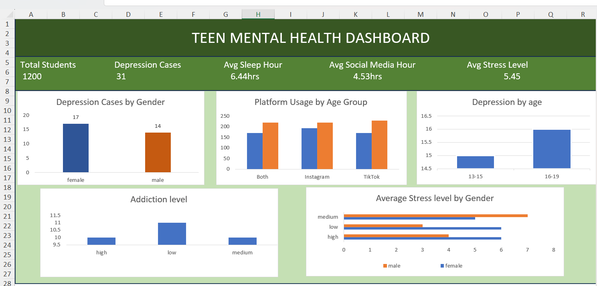

# 📊 Teen Mental Health Dashboard (Excel)

## 📌 Project Overview

This project is an Excel dashboard that analyzes teen mental health based on social media usage, sleep habits, stress levels, and depression.

The dashboard was created using Microsoft Excel to present key insights in a clear and easy-to-understand format.

---

## 🛠 Tools Used

- Microsoft Excel
- Pivot Tables
- Charts
- KPI Cards

---

## 📊 Dashboard

---

## 📈 Dashboard Includes

- Total Students
- Depression Cases
- Average Sleep Hours
- Average Social Media Hours
- Average Stress Level
- Depression Cases by Gender
- Platform Usage by Age Group
- Depression by Age Group
- Addiction Level
- Average Stress Level by Gender

---

## 📂 Files

- `Teen_Mental_Health_Dataset.xlsx`
- `Teen_Mental_Health_Dataset.csv`
- `Dashboard.png`

---

## 👨‍💻 Author

**Harshitha P**

GitHub: https://github.com/harshithakulal76-star
